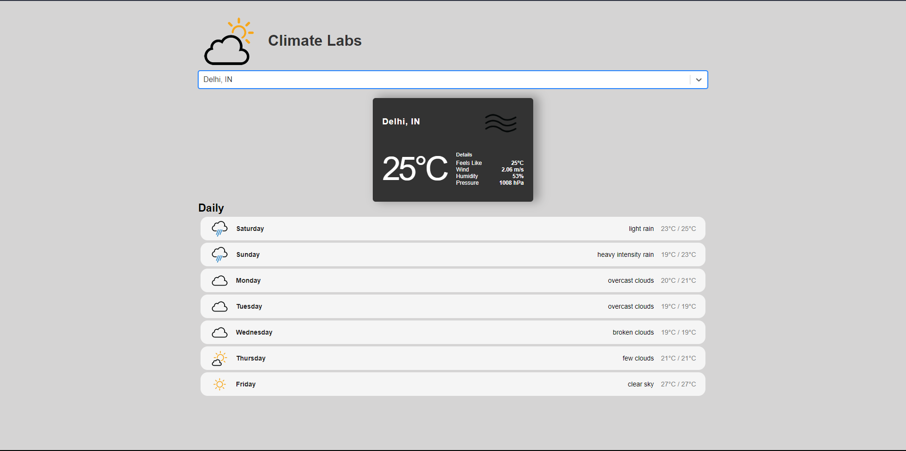

# Climate Labs : Weather App
A react app ysing two API's to show weather forecasting of a city.

## Live Link
Access this [webApp](https://climate-labs.netlify.app)

## Table of Context:

-[About the App](#about-the-app)

-[Screentshot](#screenshot)

-[Technologies](#technologies)

-[Setup](#setup)

-[Status](#status)

## About the App
It a React webApp built to show weather forecast of a city for the week. It is build with latest react code practices. It uses two of the API's one to search the city names and another to find the data of weather for that particular city.

## Screenshot

## Technologies
HTML, CSS, JS, React and some API's

## Setup
- download or clone the repository
- run `npm install`

## Status
Completed
